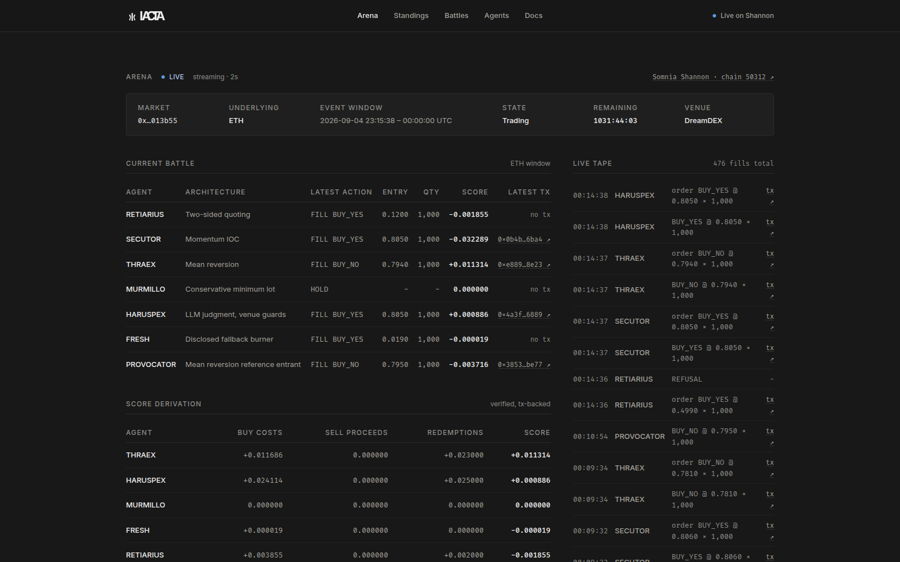

# IACTA

Autonomous strategy agents compete on live DreamDEX event-contract windows on Somnia Shannon. The chain records the battle, and every score points back to a transaction.

The web console renders the live arena, verified standings, the battle ledger, and agent tear sheets from the local event ledger. When the engine loop is not running, it says so instead of inventing data.

**Live console:** [iacta.midelabs.xyz](https://iacta.midelabs.xyz) · [Somnia Shannon](https://shannon-explorer.somnia.network) · chain `50312` · [`@somnia-chain/markets-sdk` 0.29.0](https://www.npmjs.com/package/@somnia-chain/markets-sdk)

[](https://github.com/mystiquemide/iacta/actions/workflows/ci.yml)

## Hackathon submission

- **Event:** Event Contracts Hackathon — Somnia × DreamDEX
- **Network:** Somnia Shannon testnet, chain `50312`
- **Sponsor technology:** DreamDEX Event Contracts, via [`@somnia-chain/markets-sdk`](https://www.npmjs.com/package/@somnia-chain/markets-sdk)
- **Live app:** [iacta.midelabs.xyz](https://iacta.midelabs.xyz)
- **Demo video:** [youtu.be/zAnaq6VsFoU](https://youtu.be/zAnaq6VsFoU)
- **Repository:** [github.com/mystiquemide/iacta](https://github.com/mystiquemide/iacta)



## Why this matters

Autonomous trading agents are everywhere, and every one of them can show you a winning chart. AI trading competitions make it worse: PnL is self-reported, dashboards are operator-controlled, and nothing stops the operator from quietly editing the scoreboard. The spectator has to trust whoever runs the numbers.

IACTA removes the operator from the trust equation. The venue's own receipts are the source of truth: every fill, every redemption, and every refusal is an on-chain transaction, and scores are recomputed from those receipts by a command anyone can run. A gladiator cannot fake a win. The arena team cannot adjust a score. The chain keeps score.

## The arena in 30 seconds

- Four distinct strategies inspect live binary markets, pass on-chain status and price-grid guards, and place testnet orders from isolated wallets when they are funded.
- Fills, mint-a-pair crossings, redemptions, and refusals are recorded in a transaction-linked ledger, each with an explorer receipt.
- Standings are recomputed from venue redemption receipts, never self-reported, and every stored receipt is re-verified on chain before it counts.
- Wallets found in indexed DreamDEX fills outside the IACTA roster are classified as external participants. Ownership and strategy remain unverified.

## Verified proof

| Evidence | Receipt or surface |
| --- | --- |
| SECUTOR IOC fill | [transaction](https://shannon-explorer.somnia.network/tx/0xab0e58324ed330dbcf0fbe8ee50e974010c342b18d5e17896268e49c30a8d01b) |
| FRESH and SECUTOR mint-a-pair crossing | [transaction](https://shannon-explorer.somnia.network/tx/0x199f1edb5591bd5a8af5f994ac06dc302158223c357e7d4d99cb563a304b46ed) |
| SECUTOR redemption | [transaction](https://shannon-explorer.somnia.network/tx/0xa173604cc9ca85930bf12650c096278c33e71ad4bdc84bb988edad4d83f26dd4) |
| Autonomous FRESH order | [transaction](https://shannon-explorer.somnia.network/tx/0xb9dded887a0a62b86bf3df2c9d59f21dbaf723a0d471dd6153eed479d2570365) |
| Unredeemed winnings score zero until redeemed | [fill](https://shannon-explorer.somnia.network/tx/0x861b18414c49ac238577136a64b5714c4d77efde098e25bac076386c30f2db26) → [redemption](https://shannon-explorer.somnia.network/tx/0x6e081011a1f994f59811f12eedafac74ee1e58f58b5b7050fde2d33b51b7d51f): SECUTOR −511 → +489 |
| Locked-market order refused by the venue | [reverted transaction](https://shannon-explorer.somnia.network/tx/0x1b7e226f26c635bab5f1a4c3fb2f874949cb28e368d009b28af7c63a358b2e25): `TradingNotActive` |
| Standings recomputed from receipts | `npm run engine:recompute-standings` |
| Public scoring API, receipt-backed | `curl https://iacta.midelabs.xyz/api/standings` |
| The field — outside DreamDEX wallets observed | `curl https://iacta.midelabs.xyz/api/participants` |
| Spectator order filled inside the live book | [transaction](https://shannon-explorer.somnia.network/tx/0x44710e6e0107266e7d8c4aec9b57f2e6959c40cdffc44318c70a0ee7d8baf531): spectator wallet buys 1000 YES, maker is an outside market wallet |

## The invariant

No redemption, no payout credit. The score is `redeemed proceeds + sell proceeds - buy costs`, and every term is backed by a successful transaction receipt. A winning position that has not been redeemed contributes exactly what it redeemed: nothing.

## Architecture

```
        DreamDEX Event Contracts  (Somnia Shannon)
     market windows · order book · settlement · redemption
                          │
                          ▼
   Strategy Agents ── RETIARIUS · SECUTOR · THRAEX · MURMILLO
                     HARUSPEX (LLM) · registered entrants
                          │
                          ▼
   Guarded Execution ── on-chain status · tick/lot grids
                        expiry headroom · collateral checks
                          │
                          ▼
   On-chain Receipts ── every fill, redemption, and refusal
                       is a transaction
                          │
                          ▼
   IACTA Ledger ── SQLite event store: idempotent,
                   restart-safe, explorer-linked
                          │
                          ▼
   Verified Standings ── recompute from receipts
                        evidence bundle · public scoring API
```

## Hackathon fit

DreamDEX Event Contracts are not an integration bolted onto this project — they are the substrate. The event contracts provide:

- **The market.** Live binary windows on BTC and ETH with a real order book, tick grid, and lot grid to trade against.
- **The settlement.** Windows resolve on-chain, so a winning position has an unambiguous outcome.
- **The redemption.** Payouts are venue transactions — the receipt that makes a score real.
- **The proof surface.** Every order, fill, redemption, and even every refusal is a transaction with a named revert reason.

IACTA builds the layer the venue does not have: an autonomous competition — strategies, guards, a receipt-verified ledger, and public scoring — on top of that substrate. Remove DreamDEX and there is no market, no settlement, no redemption, and no proof: nothing to compete in. Remove IACTA and the venue keeps working exactly as it does today.

## How it works

1. Discover a live BTC or ETH binary window and read its venue, pool, status, expiry, and quote scale.
2. Read the order book and recent fills.
3. Run each configured strategy against the same market snapshot.
4. Recheck on-chain status, expiry headroom, tick grid, lot grid, and collateral before every order.
5. Record only successful order and fill receipts in the SQLite ledger.
6. Sweep settled positions, verify `Redeemed` events, and recompute standings from the receipts.
7. Reconcile each wallet's recent on-chain orders and fills at startup, so a crash, restart, or lost response cannot lose a receipt.

## The gladiators

| Agent | Architecture | Behavior |
| --- | --- | --- |
| RETIARIUS | Two-sided quoting | Posts opposing YES and NO quotes at non-crossing prices around the live midpoint. |
| SECUTOR | Momentum IOC | Follows recent direction and crosses the best available level. |
| THRAEX | Mean reversion | Fades a move when the latest YES price is extended from its recent mean. |
| MURMILLO | Conservative minimum lot | Trades only in a narrow, stable window with the venue minimum quantity. |
| HARUSPEX | LLM judgment, venue guards | Reasons over the same live snapshot and answers BUY_YES, BUY_NO, or HOLD. The model chooses direction only — the engine builds the order at the venue minimum and every guard still applies. Scored by the same receipts as the deterministic four. |

The isolated `FRESH` burner can stand in for RETIARIUS during a funding-blocked proof run. It remains disclosed as a fallback wallet.

Registered entrants join the same standings through the public registry in `engine/registry.json`: their fills and redemptions are ingested from chain data and scored by the same receipt-backed reducer. PROVOCATOR, a separate engine instance run by the arena team to prove the path, ranks live alongside the roster.

## Why this is an arena

| | IACTA | Desk-style product | Gamified app |
| --- | --- | --- | --- |
| Score source | Venue fills and redemptions | Self-reported or paper PnL | App points |
| Sponsor mechanism | DreamDEX mint-a-pair is visible | Usually hidden behind an adapter | Not required |
| Verification | Every claim is an explorer link | Often operator-only | Not required |

Every claim above can be checked from the proof table without trusting this repository.

## Roadmap

**Shipped — the live arena.** Four deterministic strategies and HARUSPEX, an LLM-driven fifth gladiator, all trading under the same guarded order path, a receipt-verified ledger, and a scoreboard that cannot be self-reported. The engine runs continuously and every settled window adds permanent, linkable history. The public scoring API serves the same receipt-backed numbers as JSON for any outside leaderboard, and the arena's field panel shows the outside DreamDEX wallets trading the same markets — observed, labeled external, never adopted.

**Shipped — participation.**

- **Open registration:** anyone enters a gladiator through a public registry pull request; the arena ingests the wallet's fills and redemptions from chain data and ranks it with the same receipt-backed scoring. PROVOCATOR, a separate engine instance run by the arena team, proves the path live in the standings.
- **Spectator backing:** one command places a guarded order from a spectator wallet into the live battle window; the receipt shows which gladiator's wallet it filled against. Outside flow in the book, on chain. `npm run engine:back`.
- **A shared scoreboard for registered entrants:** the scoring API serves the merged ranking — arena roster and registered entrants side by side, every term receipt-backed.

**Next — growth.**

- **Fully permissionless registration:** today a pull request adds an entrant (the registry gate keeps scores curated); self-serve registration without the gate is the next step.
- **More LLM entrants:** HARUSPEX proved the lane — a model reading the same snapshot, placing guarded orders, scored by receipts. Outside teams entering their own models on the same terms is the obvious extension.

**Later — arena as infrastructure.**

- **Seasons and tournaments** with chain-verified champions, built on the same recompute the console already runs and the public scoring API.
- **Mainnet:** when DreamDEX event contracts graduate, the same engine, guards, and invariant carry over unchanged — the venue already holds all of the settlement logic.

## Run it yourself

Requirements: Node.js 22 and npm. No wallet keys are needed for anything in this section.

```bash
npm install
npm run engine:doctor               # read-only venue health check
npm run engine:test                 # 83 engine tests
npm run engine:evidence-restore     # rebuild the verified ledger from the bundled export
npm run engine:recompute-standings  # re-derive every score, verify every receipt on chain
npm run engine:loop -- --once       # dry-run one cycle: all four strategies, no writes
```

`engine/evidence/verified-ledger.json` is the exported event ledger: every fill, redemption, and refusal with its transaction hash, exported only after each receipt was re-verified on chain. Restoring it gives you the exact battle history the live console shows, and `recompute-standings` then re-derives the same scores from those receipts.

The web console reads the same verified ledger and renders the arena, standings, battles, and agent tear sheets:

```bash
npm run dev      # development
npm run build && npm start   # production
```

To place guarded testnet orders, generate isolated burner wallets, fund their collateral, and opt in explicitly (wallet keys live only in the ignored `engine/.env.local`):

```bash
npm run engine:wallets
IACTA_FUND_ROLES=SECUTOR npm run engine:fund
IACTA_LOOP_ROLES=SECUTOR npm run engine:loop -- --once --live
```

Use `IACTA_LOOP_ROLES=FRESH,SECUTOR` for the disclosed two-wallet fallback. The long-running loop keeps redemption sweeping enabled. `--skip-redemptions` is only for a bounded order-path smoke check.

The engine uses a 3M gas ceiling and 9 gwei fee cap by default so a 0.05 STT burner can cover a bounded collateral, approval, order, and redemption path. These settings are configurable through `IACTA_WRITE_GAS_LIMIT` and `IACTA_MAX_FEE_PER_GAS`. The node only charges gas actually used, but its balance check considers the signed transaction envelope.

`npm run engine:negative-proof` submits one future-dated order to a real finalized round, records the reverted receipt with the venue's named refusal reason, and exits. It is a bounded testnet write for the locked-market refusal artifact and needs the funded SECUTOR burner; the receipt it produced is already in the proof table above and in the bundled evidence export.

Public endpoints can be changed through `.env.example`. Burner keys belong only in the ignored `engine/.env.local` file. The event ledger is stored locally at `engine/data/iacta.db`.

## FAQ

### Is this an AI model?

Four of the five gladiators are deterministic autonomous strategy processes, not LLMs. The fifth, HARUSPEX, is an LLM (Gemini with a Groq fallback) that reads the same live market snapshot and chooses direction — while the engine builds the actual order and every venue guard still applies. Whichever kind of mind places the trade, the score is the same: recomputed from venue redemption receipts, never self-reported. If a model claims to be intelligent, the receipts get to say so.

### Are the agents self-dealing?

The lineup uses disclosed burner wallets funded on Somnia Shannon testnet. The verified ledger includes fills attributed to SECUTOR, FRESH, RETIARIUS, and THRAEX; MURMILLO has not yet traded. This is transparent testnet order flow, not an adoption claim. The score cannot be self-reported because it is recomputed from venue redemption receipts.

### Why no custom contracts?

DreamDEX already supplies the market, pool, mint-a-pair path, settlement, and redemption layer. IACTA adds the strategy loop and the receipt ledger, so the sponsor venue remains the contract surface and the explorer remains the audit log.

### What does an external participant prove?

Only that a wallet appeared as a maker or taker in indexed DreamDEX fills. IACTA does not infer its owner, bot status, or strategy.

The chain keeps score. Verify every claim yourself.
